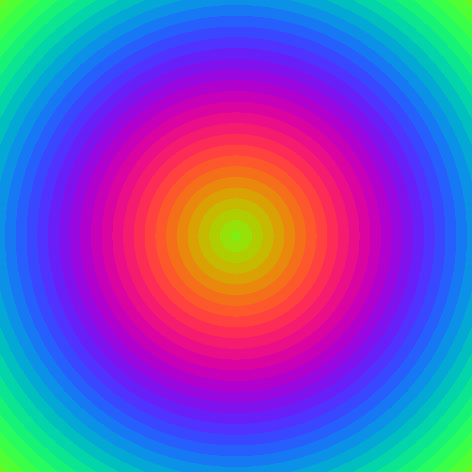

\[click on the image to start the encoder\]  
[](https://xyzzy.github.io/jsGifEncoder/)

# jsGifEncoder

Ultra-fast GIF encoder for data URL written in JavaScript. [https://xyzzy.github.io/jsGifEncoder/](https://xyzzy.github.io/jsGifEncoder/)

### Welcome to the Wonderful World of data URL's

The code was created in May 2011 and was intended to create and load images for animations.

Output is a data URL scheme as described in rfc2397.

The encoder is used by [jsFlightSim](https://xyzzy.github.io/jsFlightSim/)

## Usage

Invocation example:

```javascript
        let encoder = new GifEncoder(width, height);
        let data = encoder.encode(bpp, red, green, blue, pixels);
```

Inject into HTML:

```javascript
        document.getElementById('img').src = data;
```

## Source code

Grab one of the tarballs at [https://github.com/xyzzy/jsGifEncoder/releases](https://github.com/xyzzy/jsGifEncoder/releases) or checkout the latest code:

```sh
        git clone https://github.com/xyzzy/jsGifEncoder.git
```

## Versioning

This project adheres to [Semantic Versioning](http://semver.org/spec/v2.0.0.html). 
For the versions available, see the [tags on this repository](https://github.com/xyzzy/jsGifEncoder/tags).

## License

This project is licensed under Affero GPLv3 - see the [LICENSE.txt](LICENSE.txt) file for details.
